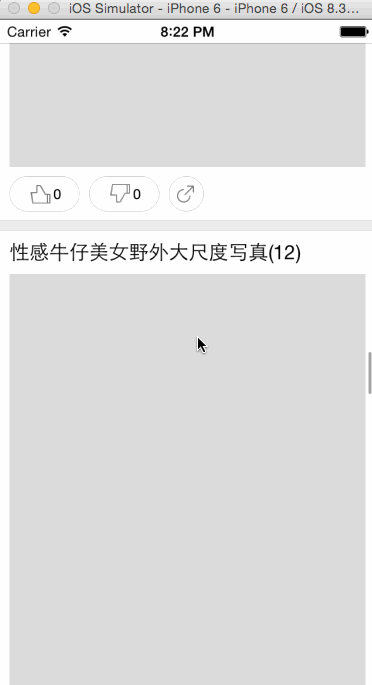

# KuailewoApp
一款练手App 服务端采用flask搭建和scrapy爬取数据
##ScreenShot

##使用第三方库
感谢以下程序的作者 
*[AFNetworking](https://github.com/AFNetworking/AFNetworking) 
*[AMScrollingNavbar](https://github.com/andreamazz/AMScrollingNavbar) 
*[SDWebImage](https://github.com/rs/SDWebImage) 
*[友盟分析](http://www.umeng.com/analytics) 
*[芒果广告SDK](http://www.adsmogo.com/) 
*[MBProgressHUD](https://github.com/jdg/MBProgressHUD) 
*[XHTwitterPaggingViewer](https://github.com/xhzengAIB/TwitterPaggingViewer) 
